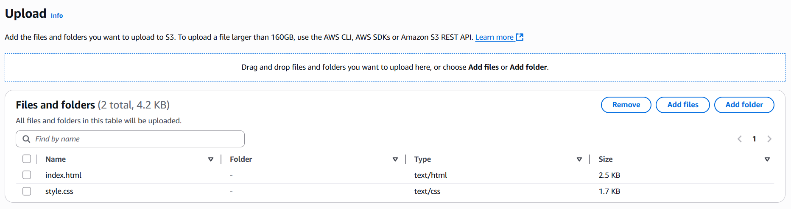
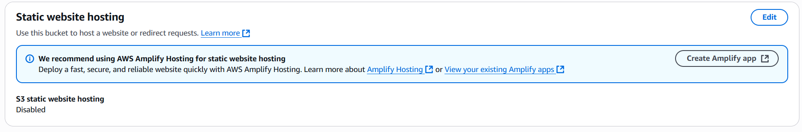
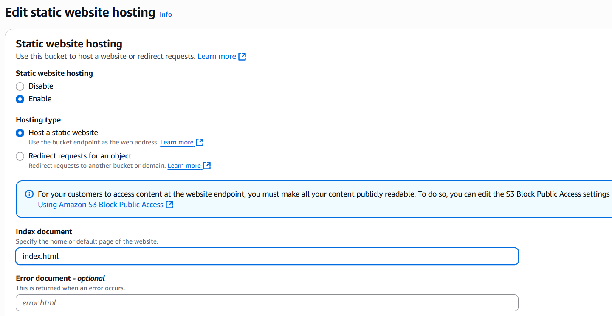
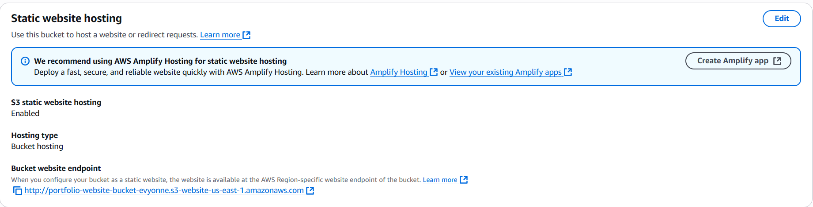
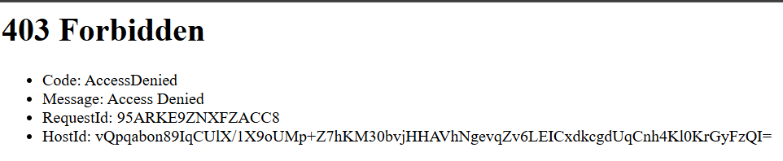
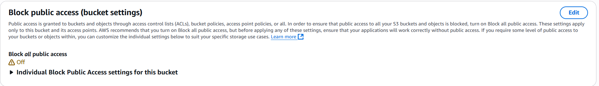
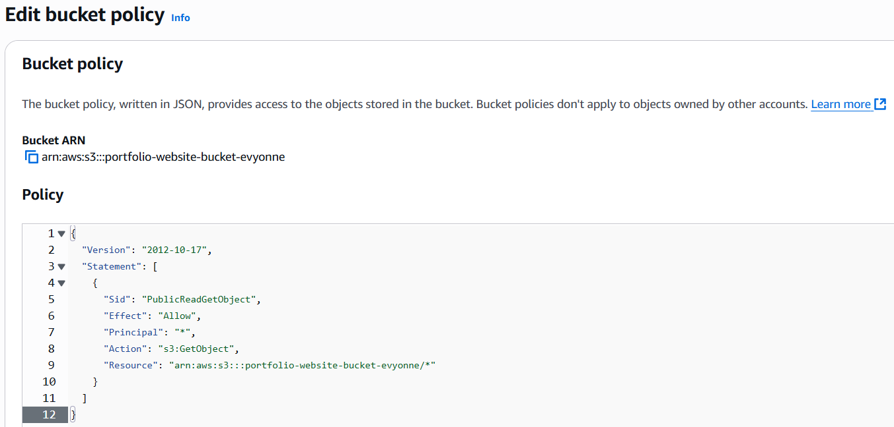
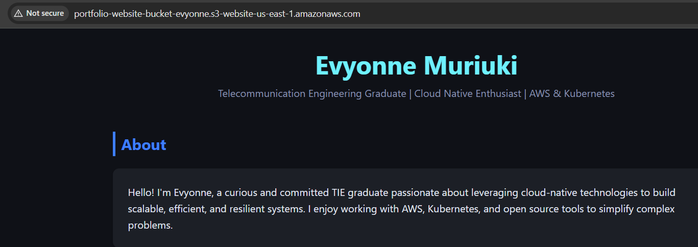

### HOSTING A STATIC WEBSITE ON AMAZON S3
## 1. Create a bucket
- Log in to the AWS management console.\
**Confirm the desired region is selected at the top right. The bucket will be hosted in the specified region.**
- Access Amazon S3 from the service menu on the top left of the console.
- Create a bucket and give it a globally unique name.
## 2. Upload website content to your bucket
- Upload html, css and other necessary files to the S3 bucket.\

## 3. Configure a static website on Amazon S3
- Under **Properties** tab of the S3 bucket, navigate to **Static Website Hosting** and click **edit**. Note that the feature is *disabled*.\

- Enable and specify the home page of the website(this is compulsory).\

- An endpoint URL now appears in the **Static Website Hosting** panel.
\
- Testing this URL on a browser, an error displays.\

## 4. Allow public access to the website.
- Enable public access in the bucket settings: Under the **Permissions** tab of the S3 bucket, turn off the *block all public access* setting.\
Refresh the website. The error is still there.
- Attach a bucket policy that allows public read access.
The policy only allows users to view the website pages. \
The website now displays successfully. 
